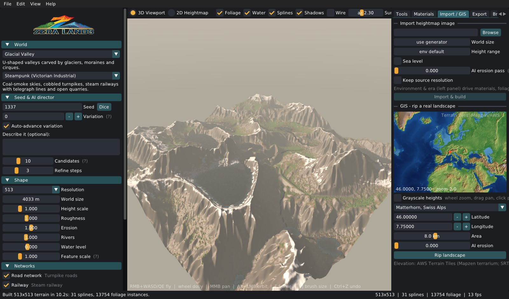
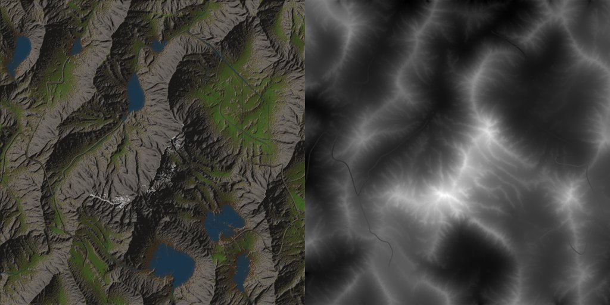
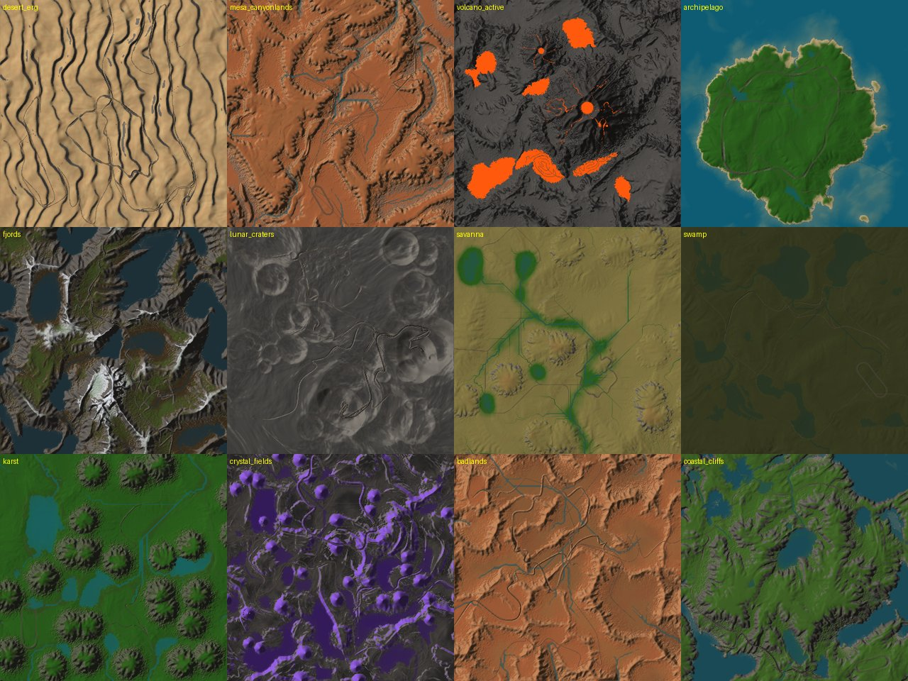

# ZeraLands 2.0

**AI-directed landscape generator and editor, written in C++.**
Generate realistic, eroded terrain for 47 environments across 12 eras of history (and beyond), with era-styled road,
rail, path and racetrack networks, foliage, PBR materials, a real-world GIS ripper, sculpting, an Unreal-style foliage
painter and spline road builder — then export everything to your engine.



| Landscape evolution (shaded / heightmap) | Environment sweep |
|---|---|
|  |  |

## Highlights

* **Real-world style terrain, not noise.** A *landscape-evolution* model (tectonic uplift vs. stream-power river
  incision, Braun–Willett implicit scheme) carves dendritic valley networks and sharp ridgelines; then droplet hydraulic
  erosion, thermal weathering, wind and depression-aware hydrology (lakes, rivers, sea, moisture) finish the job.
  Noise octaves are limited to the resolution's Nyquist budget, so maps never get the streaky "combed" look.
* **AI terrain director.** Each Generate breeds a population of candidate layouts (tectonic ranges, basins, volcanoes,
  craters, quarries...), scores them against the environment's real-world targets (relief, mean slope, flat land,
  water coverage, drainage interest, balance), hill-climbs the winner and fits the vertical scale to realistic slopes.
  You get a report explaining the choice.
* **Seeds that evolve.** Same seed + new *variation* = a close relative of the same landscape (same big layout, new
  details). Auto-advance breeds the next variation on every Generate; keep the number to reproduce a map exactly.
* **Describe it.** Optional natural-language intent: *"huge jagged snowy peaks with a few lakes and a river"*,
  *"very flat, no rivers"*, *"an island with a volcano and canyons"* — intensifiers and negation are understood.
* **47 environments** (all ZeraLands 1.x terrain types kept; their old names still work) and **12 eras**:
  Before the Beginning of Time, Dinosaur Age, Before the Flood, Ancient Middle East, Roman Empire, Medieval,
  Steampunk, 1970s, Present Day, 2026, Futuristic, Atomic Wasteland. Eras restyle networks, foliage, materials,
  terrain (craters, farm terraces, quarries, volcanism) and the sky.
* **Networks (each toggleable)** — not city grids: settlements are placed where people would live, linked by a spanning
  network with a few loops, routed by direction-aware A* with grade, turn and bridge costs, then turned into graded
  splines that cut and fill the terrain (embankments widen with fill height).
  * Roads: Roman *viae* are ruler-straight paved roads, medieval cart roads wind, modern highways get lane markings,
    futuristic glow guideways; primordial worlds get molten fissures.
  * Railway (or the era's equivalent): canals & qanats, Roman aqueducts on columns, steam railways with telegraph
    poles, high-speed rail, elevated maglev.
  * Small paths: winding trails from settlements to peaks, viewpoints and shores.
  * Racetrack: chariot circus, camel oval, jousting ground, classic road circuit, Grand Prix circuit with kerbs and a
    start/finish line, banked anti-grav circuit... laid out on the flattest dry site with grade-limited elevation.
* **2D heightmap view ↔ 3D viewport** (Tab). 2D modes: height, shaded, materials, slope, water/flow, moisture.
* **Tools (Unreal-like):** sculpt (raise, lower, smooth, flatten, noise, erode, terrace), **foliage paint** (multi-type
  brush with density, falloff, scale range, slope limit, erase with Shift), **spline road builder** (click to add,
  drag to move, Del to remove; width, shoulder, banking, closed loops, markings, kerbs, elevated decks, canals,
  props along the spline). Full undo/redo.
* **PBR materials without tiling or stretching:** stochastic anti-tiling (per-region virtual tile offsets blended by
  texture contrast), far-distance scale blending, macro colour variation, triplanar projection on cliffs, and
  height-based layer blending. Point it at your texture folder — see *Texture library* below.
* **Import any heightmap** (PNG 8/16-bit, JPG, TGA, BMP, WebP, RAW/R16), optionally run an "AI erosion pass" in the
  style of the chosen environment, customise with the tools and export.
* **GIS:** pick any place on an interactive world elevation map (heightmap or hypsometric colours) or a famous-place
  preset (Matterhorn, Everest, Grand Canyon, Fuji, Geirangerfjord, Kilauea...) and rip a real landscape at your
  resolution. Data: AWS Terrain Tiles (Mapzen "terrarium"; SRTM, GMTED, ETOPO1 and other sources), no API key.
* **ZeraBrain** — a small ML system that learns from every map you make (generated, imported, ripped, exported) as the
  foundation for future prompt-to-map generation. See [docs/ML.md](docs/ML.md).
* **Export:** 16-bit PNG, Unreal `.r16`, per-layer weightmaps + RGBA splat packs, normal map, colour preview,
  foliage instances (CSV), splines (JSON), OBJ mesh, and metadata with ready-to-use Unreal/Unity import scales.
* **Projects:** save/load `.zlproj` (+ `.zlbin`) including sculpting, splines and painted foliage.

## Environments

| Category | Environments |
|---|---|
| Arid | Sand Dune Sea (Erg) (`desert_erg`), Rocky Desert (Hamada) (`desert_hamada`), Badlands (`badlands`), Mesas & Canyonlands (`mesa_canyonlands`), Salt Flats (`salt_flats`), Desert Oasis (`desert_oasis`), Red Rock Desert (`red_rock`), Loess Plateau (`loess_plateau`) |
| Mountain | Alpine Mountains (`mountains_alpine`), Rolling Hills (`rolling_hills`), Highlands & Moors (`highlands`), Plateau & Tablelands (`plateau`), Extreme Spikes (`extreme_spikes`), Rocky Crags (`rocky_crags`), Rift Valley (`rift_valley`) |
| Volcanic | Active Volcano (`volcano_active`), Magma Fields (`magma_fields`), Volcanic Islands (`volcanic_islands`), Basalt Columns & Ash Wastes (`basalt_columns`), Caldera Lake (`caldera_lake`) |
| Cold | Glacial Valley (`glacial_valley`), Arctic Tundra (`arctic_tundra`), Ice Sheet & Frozen Wastes (`ice_sheet`), Fjords (`fjords`), Taiga (Boreal Forest) (`taiga`) |
| Temperate | Temperate Forest (`temperate_forest`), Grassland Plains (Prairie) (`grassland_plains`), Steppe (`steppe`), River Valley (`river_valley`), River Canyons (`canyon_river`), Karst Tower Forest (`karst`), Mediterranean Hills (`mediterranean`) |
| Tropical | Tropical Rainforest (Jungle) (`rainforest`), Savanna (`savanna`), Tropical Archipelago (Atolls) (`archipelago`), Mangrove Coast (`mangrove_coast`), Tepui Table Mountains (`tepui`), Cenote Sinkhole Plains (`cenote_plains`) |
| Wetland | Swamp & Bayou (`swamp`), Marshland & River Delta (`river_delta`) |
| Coastal | Coastal Cliffs (`coastal_cliffs`), Sandy Beach Coast (`beach_coast`), Chalk Downs & White Cliffs (`chalk_downs`) |
| Exotic | Lunar Crater Field (`lunar_craters`), Crystal Fields (`crystal_fields`), Alien Spires (`alien_spires`), Martian Plains (`martian_plains`) |

## Building

Requirements: CMake ≥ 3.20, a C++17 compiler, Git (dependencies are fetched automatically: GLFW, Dear ImGui, GLEW,
stb, lodepng, libwebp, nlohmann/json). No Python needed.

### Windows (Visual Studio 2022)

```powershell
cmake -S . -B build -G "Visual Studio 17 2022" -A x64
cmake --build build --config Release
build\Release\ZeraLands.exe
```

or simply run `build_windows.ps1`, which builds and packages `dist\ZeraLands\` (exe + assets + CLI).

### Linux

```bash
sudo apt install build-essential cmake git libx11-dev libxrandr-dev libxinerama-dev libxcursor-dev libxi-dev \
                 libgl1-mesa-dev libwayland-dev libxkbcommon-dev curl
cmake -S . -B build -DCMAKE_BUILD_TYPE=Release
cmake --build build -j
./build/ZeraLands
```

### macOS

```bash
cmake -S . -B build -DCMAKE_BUILD_TYPE=Release && cmake --build build -j && ./build/ZeraLands
```

Options: `-DZL_BUILD_APP=OFF` (CLI only, no GPU libraries), `-DZL_WITH_WEBP=OFF`.

## Using the editor

1. **World** — choose an environment and an era (hover for descriptions).
2. **Seed & AI director** — type any seed (numbers or words), optionally describe what you want, press **GENERATE**
   (Ctrl+G). Press again for the next variation of the same seed.
3. **Shape / Networks / Foliage** — resolution (UE sizes marked), world size, height, erosion, rivers, water level,
   feature scale; toggle roads, railway, small paths and the racetrack (labels show the era's style).
4. Explore in **3D** or **2D** (Tab), sculpt, paint foliage, edit or draw splines.
5. **Export** tab (or File → Export now).

| 3D viewport | |
|---|---|
| Hold RMB + W/A/S/D, Q/E | fly (Shift = fast, wheel while flying = speed) |
| Wheel | dolly |
| MMB drag | pan |
| Alt + LMB drag | orbit |
| F | frame the terrain |
| [ / ] | brush size |
| Ctrl+Z / Ctrl+Y | undo / redo |
| Del, Enter/Esc | delete spline point, finish spline |

2D view: wheel to zoom, RMB/MMB to pan; all tools work there too.

### Texture library

Materials tab → *Browse* to your PBR folder (for example the `pbr` folder from Google Drive) → *Scan library*.
ZeraLands recursively finds texture sets and recognises:

* map suffixes: `_diffuse`, `_albedo`, `_basecolor`, `_color` · `_normal` / `_nor_gl` (`_normal_dx` is flipped) ·
  `_roughness` (or `_gloss` / `_specular`, inverted) · `_occlusion` / `_ao` · `_displace` / `_height` / `_bump`;
  the `Name_map_xtm.webp` layout (`[2K]Ground14/Ground14_diffuse_xtm.webp`) is supported directly;
* formats: WebP, PNG, JPG, TGA, BMP;
* material type from the set and folder names (Ground → Dirt, Rock → Rock, Snow, Gravel, Sandstone, Asphalt,
  `grass_path` → Grass, `forrest_ground` → Forest floor, ...). Related layers borrow a set and are colour-shifted
  (Cliff ← Rock, Dry grass ← Grass, Mud ← Ground...). Anything unmatched falls back to a seamless procedural material.

Every terrain layer can be reassigned to any set and given its own tile size; *Shuffle variants* picks different
matching sets. The library location is remembered.

### Import, customise, export

Import / GIS tab → choose an image → set world size, height range, optional sea level and **AI erosion pass** →
*Import & build*. The current environment/era decide erosion style, water, networks, foliage and materials.
Sculpt and paint, then *Re-run erosion & rebuild* (Tools → Sculpt) if you want the landscape re-weathered.

### GIS

Import / GIS tab: drag/zoom the world elevation map and click a spot (or pick a famous place), set the area (km) and
press *Rip landscape*. Tiles are cached in the user data folder. Downloads use `curl` (Linux/macOS) or the built-in
Windows downloader.

### Unreal Engine import

Use `<name>_height.r16` (or `_height16.png`) in Landscape mode with the scales in `<name>_metadata.json`
(`unreal.scaleXYcm`, `unreal.scaleZ`, `unreal.locationZcm`). Use `_layerN_<Material>.png` as layer weightmaps,
`_foliage.csv` for instance placement and `_splines.json` for landscape splines.

## Command line

```
zeralands_cli --env mountains_alpine --era roman --seed 42 --variation 3 \
              --prompt "huge peaks with a few lakes" --res 2017 --rail --race --out exports --previews
zeralands_cli --gis-place 0 --res 1009 --era medieval          # Matterhorn, medieval
zeralands_cli --gis 36.097 -112.113 16 --env mesa_canyonlands  # any lat/lon/km
zeralands_cli --import my_map.png --import-erosion 0.6 --env fjords --save-project fjord.zlproj
zeralands_cli --list            # environments, eras, GIS places
zeralands_cli --brain-stats     # ZeraBrain status
```

## Project layout

```
src/core   engine (no GPU): noise, director, landscape evolution & erosion, hydrology, environments, eras,
           networks & splines, foliage, materials, texture library, GIS, ZeraBrain, import/export, projects
src/app    editor: renderer (OpenGL 3.3), ImGui UI, tools, world map
src/cli    headless generator
docs/      ML.md (ZeraBrain)
assets/    logo & icons
```

## Credits

Dear ImGui, GLFW, GLEW, stb, lodepng, libwebp, nlohmann/json. Elevation data: AWS Terrain Tiles / Mapzen
(© contributors of SRTM, GMTED2010, ETOPO1, NED and others — see the AWS open data registry for attribution).
Stochastic texturing after Inigo Quilez; landscape evolution after Braun & Willett (2013) and Cordonnier et al. (2016).
